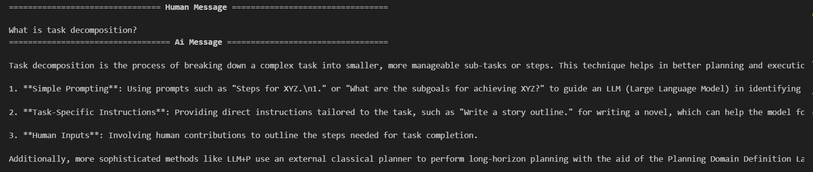

# 🧠 Proyecto: Retrieval-Augmented Generation (RAG) con LangChain + Pinecone + OpenAI

## 🎯 Objetivo
Este proyecto implementa un **RAG (Retrieval-Augmented Generator)** en Python usando **LangChain**, **Pinecone** y **OpenAI**.  
El objetivo es permitir que un modelo de lenguaje genere respuestas fundamentadas en **documentos vectorizados** que se cargan previamente en un índice de Pinecone.

---

## 🧱 Arquitectura de tu implementación

Tu notebook `rag.ipynb` sigue esta estructura de flujo:

1. **Configuración del entorno**
   - Se cargan las claves de OpenAI y Pinecone desde `.env`.
   - Se definen variables como `PINECONE_INDEX_NAME` (`rag-index`).

2. **Inicialización de componentes**
   - Se instancian los embeddings con `OpenAIEmbeddings(model="text-embedding-3-small")`.
   - Se conecta con Pinecone mediante el cliente `Pinecone()` y se crea el índice si no existe.

3. **Ingesta de documentos**
   - Los documentos se cargan y dividen en *chunks* con `RecursiveCharacterTextSplitter`.
   - Se suben al índice de Pinecone usando `PineconeVectorStore.from_documents`.

4. **Consulta (RAG)**
   - Se define un `retriever` a partir del `vectorstore`.
   - Se arma un `ChatPromptTemplate` con contexto + pregunta.
   - Se combina el `retriever` con el `ChatOpenAI` para obtener respuestas contextuales.

---

## 📂 Estructura del proyecto
```
rag-project/
├── rag.ipynb            # Notebook principal con toda la implementación
├── .env                 # Variables de entorno (API keys)
├── .gitignore           # Exclusión de archivos sensibles
└── README.md            # Este archivo
```

---

## ⚙️ Requisitos

### Python recomendado
Usa **Python 3.12 o 3.13**  
⚠️ Evita Python 3.14 (problemas con NumPy y wheels).

### Dependencias
Instálalas con:
```bash
pip install langchain langchain-openai langchain-pinecone pinecone-client python-dotenv tiktoken
```

### Variables de entorno
Asegúrate de tener un archivo `.env` en la raíz del proyecto con este formato:
```
OPENAI_API_KEY=sk-xxxxxx
PINECONE_API_KEY=pcsk-xxxxxx
PINECONE_INDEX_NAME=rag-index
PINECONE_CLOUD=aws
PINECONE_REGION=us-east-1
```


---

## ▶️ Ejecución paso a paso

1. **Abrir el notebook**
   ```bash
   jupyter notebook rag.ipynb
   ```

2. **Configurar API Keys**
   Si usas `.env`, se cargarán automáticamente.  
   Si no, puedes hacerlo manualmente:
   ```python
   import os
   os.environ["OPENAI_API_KEY"] = "sk-..."
   os.environ["PINECONE_API_KEY"] = "pcsk-..."
   ```

3. **Ejecutar la ingesta**
   En la sección correspondiente del notebook:
   ```python
   from langchain_openai import OpenAIEmbeddings
   from langchain_pinecone import PineconeVectorStore
   from pinecone import Pinecone, ServerlessSpec
   from langchain.text_splitter import RecursiveCharacterTextSplitter
   ```

   - Se crearán los *chunks* de texto.
   - Se generarán los embeddings con OpenAI.
   - Se indexarán automáticamente en Pinecone (`rag-index`).

4. **Realizar una consulta**
   Una vez completada la ingesta, puedes hacer preguntas al modelo:
   ```python
   question = "¿Qué información contienen los documentos cargados?"
   result = chain.invoke({"input": question})
   print(result["answer"])
   ```

---

## 🧩 Ejemplo de salida esperada
```

```


---

## 🧠 Buenas prácticas incluidas
- Uso de `.env` para claves API  
- Creación automática del índice Pinecone  
- Uso de `RecursiveCharacterTextSplitter` para chunking  
- Recuperación contextual top-k (RAG real)  
- Notebook autoexplicativo y modular

---

## 📚 Referencias
- [LangChain RAG Tutorial](https://python.langchain.com/docs/tutorials/rag/)
- [Pinecone Integration Docs](https://python.langchain.com/docs/integrations/vectorstores/pinecone)
- [OpenAI Embeddings Guide](https://platform.openai.com/docs/guides/embeddings)
- [LangChain Chat Models](https://python.langchain.com/docs/integrations/chat/openai/)
